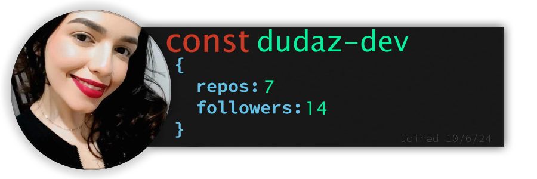

Olá! Sou um entusiasta do desenvolvimento frontend com habilidades em HTML, CSS, JavaScript e React. Estudante de Análise e Desenvolvimento de Sistemas, busco aplicar e expandir meu conhecimento em um estágio desafiador. 

## **About me:**

* Gabryel Costa, 30 years
* Full Stack programmer
* Currently studying React, Ruby and Javascript
* 1 Year, 5 Months and 25 Days since I started programming

## **Skills wall:**

## **Recent projects:**

## **You can find me on:**

*Click to be redirected*

## **Last follower**

